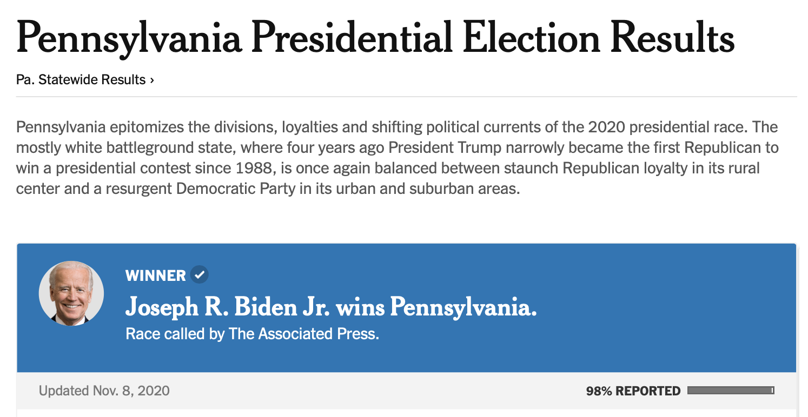
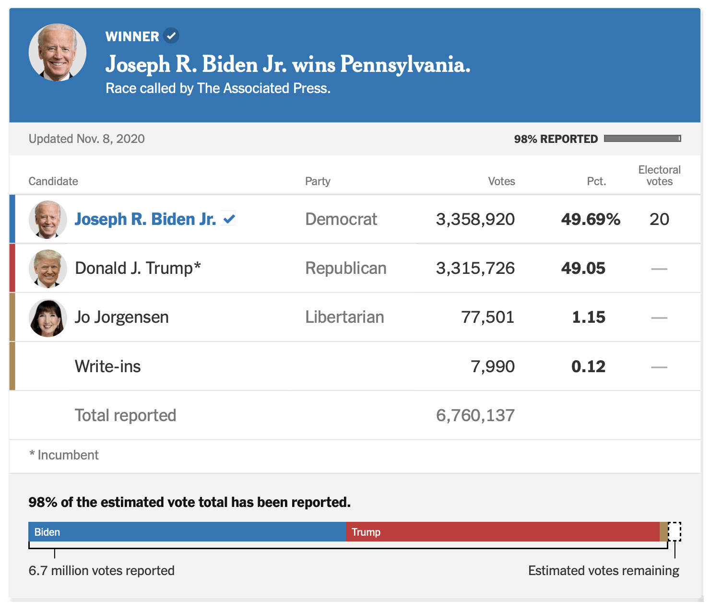
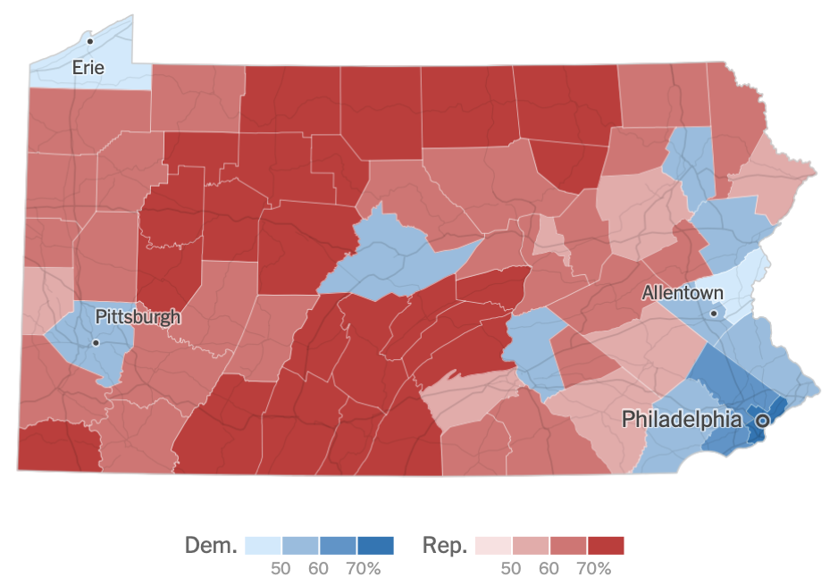
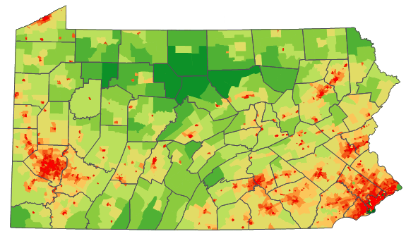
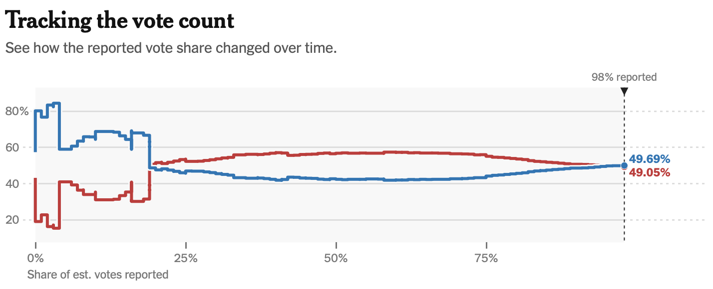
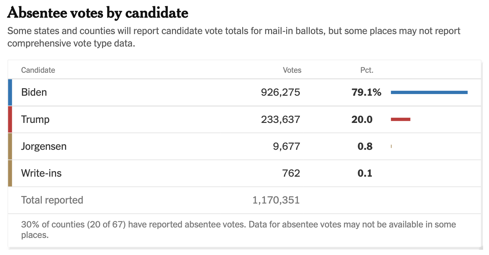

```{r setup, include=FALSE}
library(dplyr)
library(magrittr)
library(mice)
library(ggplot2)
library(reshape2)
theme_update(plot.background = element_rect(fill = "transparent", colour = NA))
knitr::opts_chunk$set(dev.args=list(bg="transparent"), dev = "svg")

```

## Very useful
You can access the course materials quickly from

[www.gerkovink.com/fundamentals](https://www.gerkovink.com/fundamentals)

$$\quad$$

You can reach me at [G.Vink@uu.nl](mailto:g.vink@uu.nl) or via the MS Teams channels

## Laura Boeschoten
<div> 
<center>

</center>
</div>

## About me
<div> 
<center>

</center>
</div>

# A small primer

## Election data from NY Times

<div> 
<center>

</center>
</div>

## Distribution of votes
<div> 
<center>

</center>
</div>


## Per county
<div> 
<center>

</center>
</div>


## Population density
<div> 
<center>

</center>
</div>


## Time of vote
<div> 
<center>

</center>
</div>

## Absentee votes
<div> 
<center>

</center>
</div>

# Goal of this course

## Real-world Goal

We learn to use regression; a technique that is aimed at figuring out the strength of the relation between an outcome and a set of predictors. 

It is basically one of the following three scenarios:
```{r echo = FALSE, message=FALSE}
data.frame(x = 1:10) %>%
  mutate("positive" = x, 
         "negative" = rev(x), 
         "no relation" = 5.5) %>%
  melt(id = "x") %>%
  mutate("relation" = variable) %>%
  ggplot(aes(x = x, y = value, color = relation)) + 
  ylab("Outcome") + 
  xlab("Predictor") + 
  geom_point() + 
  geom_smooth(method = "lm")
```

## Another example
```{r echo=FALSE, warning=FALSE}
set.seed(123)
data <- mvtnorm::rmvnorm(n = 100, mean = c(20, 5.8), 
                sigma = matrix(c(1, .8, .8, 1), 
                nrow = 2, ncol = 2)) %>% as.data.frame()
colnames(data) <- c("Hours", "Grade")

data %>% 
  ggplot(aes(x = Hours, y = Grade)) + 
  geom_point()
```

In general it holds that the more hours you spend on studying, the higher your grade. But this relation is not 1:1.

## What is the relation?
```{r echo=FALSE, message=FALSE}
data %>% 
  ggplot(aes(x = Hours, y = Grade)) + 
  geom_point() + 
  geom_smooth(method = "lm", se = FALSE) + 
  ggtitle("Grade ~ Hours")
```

We will learn to identify the average conditional relation between outcome and predictors. 

## Who passed?
```{r echo = FALSE, message=FALSE}
data %>% 
  mutate(Result = cut(Grade, breaks = c(0, 5.5, Inf), labels = c("passed", "failed"))) %>%
  ggplot(aes(x = Hours, y = Grade, color = Result)) + 
  geom_point() + 
  geom_smooth(method = "lm", se = FALSE) + 
  ggtitle("Grade ~ Hours + pass/fail")
```

We will learn to differentiate our investigation between different groups. For example, is there a difference in the relation between `Hours` and `Grade` for different groups?

## Who passed?

```{r echo = FALSE, message=FALSE}
data %>% 
  mutate(Result = cut(Grade, breaks = c(0, 5.5, Inf), labels = c("passed", "failed")), 
         Prob = predict(glm(Result ~ Hours, family = binomial(link = "logit")), type = "response")) %>%
  ggplot(aes(x = Hours, y = Prob)) + 
  geom_line() +
  ylab("Probability of Passing the Exam") + 
  geom_point(aes(x = Hours, y = as.numeric(Result)-1, color = Result))
```

Finally, we will learn how to estimate the probability of `pass` or `fail`, based on the `Hours` studied. In other words, how many `Hours` should you study to pass?

## Real-world Example
```{r echo=FALSE, warning=FALSE, background="transparent", message=FALSE}
boys %>% 
  filter(age > 5) %>% 
  ggplot(aes(x = age, y = bmi)) + 
  geom_point() + 
  geom_smooth(method = "lm", se = FALSE)
```

What is the relation between `age` and `bmi`

## Real-world Example
```{r echo=FALSE, warning=FALSE, background="transparent", message=FALSE}
boys %>% 
  mutate(class = cut(bmi, breaks = c(0, 18, 25, 30, Inf), labels = c("underweight", "healthy", "overweight", "obese"))) %>%
  filter(age > 5, !is.na(bmi)) %>% 
  ggplot(aes(x = age, y = bmi, color = class)) + 
  geom_point() + 
  geom_smooth(method = "lm", se = FALSE)
```

Can we infer the relation between `age` and `bmi`, but now for different levels of `bmi`

## Real-world Example
```{r echo=FALSE, warning=FALSE, background="transparent", message=FALSE}
boys %>% 
  filter(age > 5, !is.na(bmi)) %>%
  mutate(class = cut(bmi, breaks = c(0, 25, Inf), labels = c("not overweight", "overweight")),
         Prob = predict(glm(class ~ age, family = binomial(link = "logit")), type = "response")) %>%
  ggplot(aes(x = age, y = Prob)) + 
  geom_line() +
  ylab("Probability of being overweight") + 
  geom_point(aes(x = age, y = as.numeric(class)-1, color = class))
```

Finally, if we would develop some intervention campaign; which `age`-group(s) should be targeted?

## What else?
Learn to keep your *cool*

<center>
  
</center>

and build the foundation for a succesfull scripting career in predictive and inferential analytics
 
## Formal Goals

1. apply and interpret the basic methodological and statistical concepts that are associated with doing predictive and/or inferential research;
2. apply and interpret important techniques in linear and logistic regression analysis;

This means that you will learn the ins and outs of inferential and predictive research with linear and logistic models. 

 - what this all covers will become clear during the course
 - we will learn `R` to perform our data analysis and visualizations
 - we will learn the math and skills behind these ubiquitous modeling techniques
 - we will also learn the assumptions of (logistic) regression models

## Workgroups, Assignments, Exercises and Exam

[Course Manual](https://www.gerkovink.com/fundamentals/#course-manual)

- `R`-exercises: every week
- Workgroup: every Thursday @ 9am
  - group work
  - manage your expectations
- Assignments: 2 in total, graded
  - If your name is on the assignment; I assume you have contributed. 
  - If a group omits a name; I expect that you have notified that person. 
- Exam: just 1, graded

# Overview of this course

## Program

| Week #  | Topic   | `R`-practical | Workgroup | 
|---|---------|-----------|-----------|
| 1 | The elemental building blocks of `R` | Assigning objects and elements; creating vectors, matrices, dataframes and lists | Receive instructions and form groups |
| 2 | Finding the least squares solution; simple linear regression | Subsetting data; using pipes to simplify the workflow | Locate a data set for predictive modeling and formulate a research hypothesis; make sure that the set facilitates continuous and dichotomous outcomes |
| 3 | Linear modeling in `R`; testing assumptions; standardized residuals, leverage and Cook's distance | Class `lm` in `R`; modeling, prediction and visualization | Fit your defined model; evaluate if assumptions are met |
| 4 | Inferential modeling; Confidence intervals and hypothesis testing, non-constant error variance | Demonstrate confidence validity of the linear model on simulated data with `rmarkdown` | Test and quantify the effect of the defined model; continue the project in `rmarkdown` |
| 5 | Model evaluation; cross-validation; categorical variables, non-linear relations, interactions and higher-order polynomials | Cross-validation and model fit in `R` | Evaluate if the model can be improved; **Prepare assignment A; evaluate the final linear model on your own data** |

## Program

| Week #  | Topic   | `R`-practical | Workgroup | 
|---|---------|-----------|-----------|
| 6 | Simple logistic regression | Class `glm(formula, family = "binomial")` in `R`; modeling, prediction and visualization | Fit your defined model; evaluate if assumptions are met |
| 7 | Formulating the logistic model and interpreting the parameters; marginal effects | Parameter transformations; scale of the predictor/outcome and prediction and confidence intervals | Test and quantify the effect of the defined model |
| 8 | Logistic regression model evaluation; cross-validation; multiple regression; interactions | Multiple logistic regression and cross-validating the logistic regression in `R` | Evaluate if the model can be improved; **Prepare assignment B; evaluate the final logistic model on your own data** |

# We need R. What is it?

## Software
<center>

</center>


## The origin of R
- R is a language and environment for statistical computing and for graphics

- GNU project (100% free software)

- Managed by the R Foundation for Statistical Computing, Vienna, Austria.

- Community-driven

- Based on the object-oriented language S (1975)

# What is RStudio?

## Integrated Development Environment
<center>

</center>

## RStudio
- Aggregates all convenient information and procedures into one single place
- Allows you to work in projects
- Manages your code with highlighting
- Gives extra functionality (Shiny, knitr, markdown, LaTeX)
- Allows for integration with version control routines, such as Git.

# How does R work

## Objects and elements
- R works with objects that consist of elements. The smallest elements are numbers and characters.

    - These elements are assigned to objects. 
    - A set of objects can be used to perform calculations
    - Calculations can be presented as functions
    - Functions are used to perform calculations and return new objects, containing calculated (or estimated) elements. 

## The help
- Everything that is published on the Comprehensive `R` Archive Network (CRAN) and is aimed at `R` users, must be accompanied by a help file. 
- If you know the name of the function that performs an operation, e.g. `anova()`, then you just type `?anova` or `help(anova)` in the console. 
- If you do not know the name of the function: type `??` followed by your search criterion. For example `??anova` returns a list of all help pages that contain the word 'anova'

- Alternatively, the internet will tell you almost everything you'd like to know and sites such as http://www.stackoverflow.com and http://www.stackexchange.com, as well as `Google` can be of tremendous help. 
    - If you google `R` related issues; use 'R:' as a prefix in your search term
    
## Assigning elements to objects
- Assigning things in R is very straightforward: 

    - you just use `<-`

- For example, if you assign the value `100` (an element) to object `a`, you would type

```{r}
a <- 100
```

## Calling objects
- Calling things in R is also very straightforward: 

    - you just use type the name you have given to the object

- For example, we assigned the value `100` to object `a`. To call object `a`, we would type

```{r}
a
```

## Writing code
<center>

</center>

This is why we use R-Studio.

# Objects that contain more than one element

## More than one element
- We can assign more than one element to a vector (in this case a 1-dimensional congatenation of numbers 1 through 5)
```{r}
a <- c(1, 2, 3, 4, 5)
a
b <- 1:5
b
```

## More than one element, with characters
Characters (or character strings) in `R` are indicated by the double quote identifier. 
```{r}
a.new <- c(a, "A")
a.new
```
Notice the difference with `a` from the previous slide
```{r}
a
```

## Quickly identifying elements in vectors

```{r}
rep(a, 15)
```

## Calling elements in vectors
If we would want just the third element, we would type
```{r}
a[3]
```

## Multiple vectors in one object
This we would refer to as a matrix
```{r}
c <- matrix(a, nrow = 5, ncol = 2)
c
```

```{r}
matrix(a, nrow = 5, ncol = 2, byrow = TRUE)
```

## Calling elements in matrices #1
- The first row is called by
```{r}
c[1, ]
```

- The second column is called by
```{r}
c[, 2]
```

## Calling elements in matrices #2
- The intersection of the first row and second column is called by
```{r}
c[1, 2]
```

In short; (square) brackets [] are used to call elements, rows and columns.

## Matrices with mixed numeric / character data
If we add a character column to matrix `c`; everything becomes a character:
```{r}
cbind(c, letters[1:5])
```

## Matrices with mixed numeric / character data
Alternatively, 
```{r}
cbind(c, c("a", "b", "c", "d", "e"))
```

Remember, matrices and vectors are numerical OR character objects. They can never contain both and still be used for numerical calculations. 

## Data frames
```{r}
d <- data.frame("V1" = rnorm(5),
                "V2" = rnorm(5, mean = 5, sd = 2), 
                "V3" = letters[1:5])
d
```

We 'filled' a dataframe with two randomly generated sets from the normal distribution - where $V1$ is standard normal and $V2 \sim N(5,2)$ - and a character set. 

## Data frames (continued)
Data frames can contain both numerical and character elements at the same time, although never in the same column. 

You can name the columns and rows in data frames (just like in matrices)
```{r}
row.names(d) <- c("row 1", "row 2", "row 3", "row 4", "row 5")
d
```

## Calling row elements in data frames
There are two ways to obtain row `3` from data frame `d`:
```{r}
d["row 3", ]
```

and
```{r}
d[3, ]
```

The intersection between row 2 and column 4 can be obtained by
```{r}
d[2, 3]
```

## Calling columns elements in data frames
Both
```{r}
d[, "V2"] # and
d[, 2]
```
yield the second column. But we can also use `$` to call variable names in data frame objects
```{r}
d$V2
```

## Beyond two dimensions: a list
List are just what it says they are: lists. You can have a list of everything mixed with everything. 
For example, an simple list can be created by
```{r}
f <- list(a)
f
```

Elements or objects within lists can be called by using double square brackets [[]]. For example, the first (and only) element in list `f` is object `a`
```{r}
f[[1]]
```

## Lists (continued)
We can simply add an object or element to an existing list
```{r}
f[[2]] <- d
f
```
to obtain a list with a vector and a data frame. 

## Lists (continued)
We can add names to the list as follows
```{r}
names(f) <- c("vector", "data frame")
f
```

## Calling elements in lists
Calling the vector (a) from the list can be done as follows
```{r}
f[[1]]
f[["vector"]]
f$vector
```

## Lists in lists
Take the following example
```{r}
g <- list(f, f)
```
To call the vector from the second list within the list g, use the following code
```{r}
g[[2]][[1]]
g[[2]]$vector
```

## Logical operators
- Logical operators are signs that evaluate a statement, such as `==`, `<`, `>`, `<=`, `>=`, and `|` (OR) as well as `&` (AND). Typing `!` before a logical operator takes the complement of that action. There are more operations, but these are the most useful. 

- For example, if we would like elements out of matrix `c` that are larger than 3, we would type:
```{r}
c[c > 3]
```

## Why does a logical statement on a matrix return a vector?
```{r}
c > 3
```
The column values for `TRUE` may be of different length. A vector as a return is therefore more appropriate. 

## Logical operators (cont'd)
- If we would like the elements that are smaller than 3 OR larger than 3, we could type
```{r}
c[c < 3 | c > 3] #c smaller than 3 or larger than 3
```
or
```{r}
c[c != 3] #c not equal to 3
```

## Logical operators (cont'd)
- In fact, `c != 3` returns a matrix 
```{r echo=FALSE}
c != 3
```
- Remember `c`?: 
```{r echo=FALSE}
c
```

## Things that cannot be done
- Things that have no representation in real number space (at least not without tremendous effort)
    - For example, the following code returns "Not a Number"
```{r}
0 / 0
```

- Also impossible are calculations based on missing values (NA's)
```{r}
mean(c(1, 2, NA, 4, 5))
```

## Standard solves for missing values
There are two easy ways to perform "listwise deletion":
```{r}
mean(c(1, 2, NA, 4, 5), na.rm = TRUE)
mean(na.omit(c(1, 2, NA, 4, 5)))
```

## Floating point example
```{r}
(3 - 2.9)
(3 - 2.9) == 0.1
```

Why does `R` tell us that `3 - 2.9` $\neq$ `0.1`?

```{r}
(3 - 2.9) - .1
```

## Some programming tips:
- keep your code tidy
- use comments (text preceded by `#`) to clarify what you are doing
    - If you look at your code again, one month from now: you will not know what you did --> unless you use comments 

- when working with functions, use the TAB key to quickly access the help for the function's components
- work with logically named `R`-scripts
    - indicate the sequential nature of your work
- work with `RStudio` projects
- if allowed, place your project folders in some cloud-based environment

## Functions

Functions have parentheses `()`. Names directly followed by parentheses always indicate functions. For example; 

 - `matrix()` is a function
 - `c()` is a function
 - but `(1 - 2) * 5` is a calculation, not a function

## Packages
Packages give additional functionality to `R`. 

By default, some packages are included. These packages allow you to do mainstream statistical analyses and data manipulation. Installing additional packages allow you to perform the state of the art in statistical programming and estimation. 

The cool thing is that these packages are all developed by users. The throughput process is therefore very timely:

  - newly developed functions and software are readily available
  - this is different from other mainstream software, like SPSS, where new methodology may take years to be implemented. 

A list of available packages can be found on [CRAN](https://cran.r-project.org)

## Loading packages

There are two ways to load a package in `R`
```{r}
library(stats)
``` 
and
```{r}
require(stats)
```

## Installing packages
The easiest way to install e.g. package `mice` is to use
```{r eval=FALSE}
install.packages("mice")
```

Alternatively, you can also do it in `RStudio` through 

`Tools --> Install Packages`

# `R` in depth

## Workspaces and why you should sometimes save them
A workspace contains all changes you made to `R`. 

A saved workspace contains everything at the time of the state wherein it was saved. 

You do not need to run all the previous code again if you would like to continue working at a later time. 

- You can save the workspace and continue exactly where you left. 

Workspaces are compressed and require relatively little memory when stored. The compression is very efficient and beats reloading large datasets. 

## History and why it is useful
`R` by default saves (part of) the code history and `RStudio` expands this functionality greatly. 

Most often it may be useful to look back at the code history for various reasons.

- There are multiple ways to access the code history.
  
    1. Use arrow up in the console. This allows you to go back in time, one codeline by one. Extremely useful to go back to previous lines for minor alterations to the code.
    2. Use the history tab in the environment pane. The complete project history can be found here and the history can be searched. This is particularly convenient when you know what code you are looking for. 
    
## Working in projects in `RStudio`
- Every project has its own history
- Every research project has its own project
- Every project can have its own folder, which also serves as a research archive
- Every project can have its own version control system
- R-studio projects can relate to Git (or other online) repositories

## In general...
- Use common sense and BE CONSISTENT.

- Browse through [the tidyverse style guide](https://style.tidyverse.org)

  - The point of having style guidelines is to have a common vocabulary of coding 
  - so people can concentrate on what you are saying, rather than on how you are saying it. 

- If code you add to a file looks drastically different from the existing code around it, the discontinuity will throw readers and collaborators out of their rhythm when they go to read it. Try to avoid this.

- Intentional spacing makes your code easier to interpret

  - `a<-c(1,2,3,4,5)` vs;
  - `a <- c(1, 2, 3, 4, 5)`
 
 - at least put a space after every comma!

# To continue

## What to do?

1. Before Thursday: make exercise 1
2. Thursday: workgroup. 
3. After the workgroup: make exercise 3
4. Next week: 

  - R: `dplyr`, `pipes` and linear modeling. 
  - Statistics: deviations, the use of squares and simple modeling
  
# See you next week


