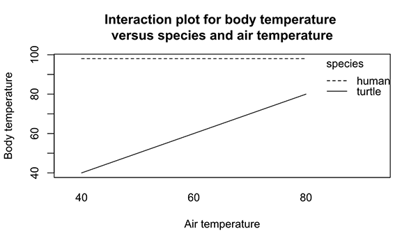

## Packages and functions used
```{r message=FALSE}
library(magrittr) # pipes
library(dplyr)    # data manipulation
library(mice)     # data
library(ggplot2)  # plotting
library(DAAG)     # data sets and functions
library(caret)    # confusion matrices
```

## Recap

With **logistic regression** we can model a binary outcome on a set of continuous, binary and/or categorical predictors. 

If we would use **linear regression** with a binary outcome variable, we would create a *linear probability model*

  - The linear probability model is a way to describe the conditional probabilities
  - It is not a good way: 
    - the residual variance is not constant (violation of homoscedasticity)
    - the residuals are not normally distributed

Because the linear probability model violates its assumptions when performed on a binary outcome variable, the standard errors and hypothesis tests are not valid. In short, you may draw invalid conclusions.  

# Titanic data

## Example: titanic data
We start this lecture with a data set that logs the survival of passengers on board of the disastrous maiden voyage of the ocean liner Titanic
```{r}
titanic <- read.csv(file = "titanic.csv", header = TRUE, )
titanic %>% head
```

## Inspect the data set
```{r}
str(titanic)
```
 
## What sources of information
We have information on the following features.

Our outcome/dependent variable:

- Survived: yes or no

Some potential predictors:

- Sex: the passenger's gender coded as `c(male, female)`
- Pclass: the class the passenger traveled in
- Age: the passenger's age in years
- Siblings.Spouses.Aboard: if siblings or spouses were also aboard
- Parents.Children.Aboard: if the passenger's parents or children were aboard

and more. 

## Hypothetically

We can start investigating if there are patterns in this data that are related to the survival probability. 

For example, we could hypothesize based on the crede "women and children first" that 

- `Age` relates to the probability of survival in that younger passengers have a higher probability of survival
- `Sex` relates to survival in that females have a higher probability of survival

Based on socio-economic status, we could hypothesize that 

- `Pclass` relates to the probability of survival in that higher travel class leads to a higher probability of survival

And so on. 

# A quick investigation

## Is `Age` related?
```{r fig.height = 3}
titanic %>% ggplot(aes(x = Age, y = Survived)) + geom_point() +
  geom_smooth(method = "glm", 
    method.args = list(family = "binomial"), 
    se = FALSE) + xlim(-1, 100)
```

## Inspecting the data
```{r}
titanic %$% table(Pclass, Survived)
```

It seems that the higher the class (i.e. `1 > 2 > 3`), the higher the probability of survival.

We can verify this
```{r}
titanic %$% table(Pclass, Survived) %>% prop.table(margin = 1) %>% round(digits = 2)
```

# A more thorough inspection

## Fitting the titanic models
Let's fit these models and gradually build them up in the number of predictors. 
```{r}
fit1 <- titanic %$% 
  glm(Survived ~ Age, family = binomial(link="logit"))

fit2 <- titanic %$% 
  glm(Survived ~ Sex, family = binomial(link="logit"))

fit3 <- titanic %$% 
  glm(Survived ~ Pclass, family = binomial(link="logit"))
```

## `Survived ~ Age`
```{r fig.height=3}
titanic %$% histogram(~ Age | Survived == 1)
```

The distribution of `Age` for the survivors (`TRUE`) is different from the distribution of `Age` for the non-survivors (`FALSE`). Especially at the younger end there is a point mass for the survivors, which indicates that children have a higher probability of survival. However, it is not dramatically different. 

## `Survived ~ Age`
```{r fig.height=3}
fit1 %>% summary %>% .$coefficients
```
We can see that there is a trend.  The log odds of `Survived` decreases with increasing `Age`. For every year increase in age, the log-odds of `Survived` decreases with `r fit1 %>% summary %>% .$coefficients %>% .[2, 1]`. However, this decrease is not too convincing given the effect, the standard error and the size of the data. Hence, the p-value is a little on the larger side. 

When we inspect the deviance
```{r}
c(fit1$null.deviance, fit1$deviance)
```
We see that there is almost no decrease in deviance between the empty model (i.e. the model with only an intercept) and the model with `Age` included. The difference in df is only 1 parameter.

## `Survived ~ Sex`
```{r fig.height=3}
titanic %$% histogram(~ Sex | Survived == 1)
```

Wow! These distributions are very different! Females seem to have a much higher probability of survival. 

## `Survived ~ Sex`
```{r fig.height=3}
fit2 %>% summary %>% .$coefficients
```
The coefficients confirm this. The log odds of `Survived` decreases for males, when compared to females. The decrease is quite pronounced, too: `r coef(fit2)[2]`. 

When we inspect the deviance
```{r}
c(fit2$null.deviance, fit2$deviance)
```
We see that there is a massive gain in the deviance between the empty model (i.e. the model with only an intercept) and the model with `Sex` included. The difference in df is only 1 parameter.

## `Survived ~ Pclass`
```{r fig.height=3}
titanic %$% histogram(~ Pclass | Survived == 1)
```

There is a very apparent difference between the distributions of the survivors and non-survivors over the classes. For example, we see that in 1st and 2nd class there are more survivors than non-survivors, while in the third class this relation is opposite. 

## `Survived ~ Pclass`
```{r fig.height=3}
fit3 %>% summary %>% .$coefficients
```
Here, there is something wrong! Class is an ordered categorical variable, not a continuous variable. In other words, we cannot simply increase the log odds of `Survived` with `r fit3 %>% summary %>% .$coefficients %>% .[2, 1]` for every unit increase in `Pclass`.

### Why not?
If we would interpret these coefficients 'as is', we would assume that class two is twice the value for class 1, that class three is 1.5 times the value for class 2, and so on. 

## Edit the data
```{r}
titanic %<>% 
  mutate(Pclass = factor(Pclass, levels = c(3, 2, 1), ordered = FALSE))
str(titanic)
```

The `Pclass` column is now correctly coded as a factor. We ignore the ordering as this goes beyond the scope of the course.

## Titanic with main effects
```{r echo=FALSE}
titanic %$% glm(Survived ~ Age + Sex + Pclass, family = binomial(link="logit")) %>% 
  summary
```

## Titanic with interactions
```{r}
fit.interaction <- titanic %$% glm(Survived ~ Age * Sex * Pclass, 
                                   family = binomial(link="logit"))
fit.interaction %>% summary %>% .$coefficients
```

Now none of the main effects are significant. The variance (differences) have flowed into the interaction effects. 

## Interactions
An interaction occurs when the (causal) effect of one predictor on the outcome depends on the level of the (causal) effect of another predictor.



[Image Source](https://en.wikipedia.org/wiki/File:Interaction_plot_body_temp.svg)

E.g. the relation between body temperature and air temperature depends on the species. 

## Visualizing the effects
To illustrate, I will limit this investigation to `Age` and `Pclass` for males only.

- We can use the `predict` function to illustrate the conditional probabilities within each class

To do so, we need to create a `new` data frame that has all the combinations of predictors we need. 
```{r}
new <- data.frame(Pclass = factor(rep(c(1, 2, 3), c(80, 80, 80))), 
                  Age = rep(1:80, times = 3),
                  Sex = rep("male", times = 240))
new <- cbind(new, 
             predict(fit.interaction, newdata = new, 
                     type = "link", se = TRUE))
head(new)
```

## Adding the predicted probabilities
There are two simple approaches to obtain the predicted probabilities. First, we could simply ask for the predicted response:
```{r}
new$prob <- predict(fit.interaction, newdata = new, type = "response")
```
Or we could use the distribution function `plogis()`:
```{r}
new$prob2 <- plogis(new$fit)
head(new)
```

## Adding confidence intervals
```{r}
new %<>% 
  mutate(lower = plogis(fit - 1.96 * se.fit),
         upper = plogis(fit + 1.96 * se.fit))

head(new)
```

## What do we have?
A data frame with simulated `Pclass` and `Age` for males.

```{r}
new %>% summary()
```

## Visualizing the effects: link
```{r fig.height=3.5}
new %>%
  ggplot(aes(x = Age, y = fit)) + 
  geom_line(aes(colour = Pclass), lwd = 1)
```

## Visualizing the effects: probabilities
```{r fig.height=3.5}
new %>%
  ggplot(aes(x = Age, y = prob)) + 
  geom_ribbon(aes(ymin = lower, ymax = upper, fill = Pclass), alpha = .2) +
  geom_line(aes(colour = Pclass), lwd = 1) + ylab("Probability of Survival")
```

## No interaction assumed
To repeat the previous scenario for the model where only main effects are included:
```{r}
fit <- titanic %$% glm(Survived ~ Age + Sex + Pclass, family = binomial(link="logit")) 
new2 <- new %>% select(Age, Pclass, Sex)
new2 <- cbind(new2, predict(fit, newdata = new2, type = "link", se = TRUE))
new2 %<>% 
  mutate(prob = plogis(fit),
         lower = plogis(fit - 1.96 * se.fit),
         upper = plogis(fit + 1.96 * se.fit))
```

## No interaction: the link
```{r}
new2 %>%
  ggplot(aes(x = Age, y = fit)) + 
  geom_line(aes(colour = Pclass), lwd = 1)
```

## No interaction: probabilities
```{r fig.height=3.5}
new2 %>%
  ggplot(aes(x = Age, y = prob)) + 
  geom_ribbon(aes(ymin = lower, ymax = upper, fill = Pclass), alpha = .2) +
  geom_line(aes(colour = Pclass), lwd = 1) + ylab("Probability of Survival")
```

## Model comparison
```{r}
anova(fit, fit.interaction, test = "Chisq") 
```
The interaction model fits much better to the data. 
```{r}
AIC(fit, fit.interaction)
```

## Prediction
```{r}
pred <- predict(fit, type = "response")
head(pred)
pred <- ifelse(pred > 0.5, yes = 1, no = 0)
head(pred)
```

## Confusion matrix
```{r}
CM <- table(pred, titanic$Survived)
CM
```

The accuracy can then be calculated as the percentage of correct predictions, i.e. the sum over the diagonal elements divided by the total number of cases:

```{r}
correct <- CM %>% diag %>% sum
correct / sum(CM)
```

## In a function {.smaller}
```{r}
confusionMatrix(as.factor(pred), reference = as.factor(titanic$Survived))
```

## Sensitivity / Specificity

```{r, echo = FALSE}
out <- data.frame(Survived = c("A", "C"), 
                 "not Survived" = c("B", "D"))
rownames(out) <- c("Predicted Survived", "Predicted not.Survived")
out
```

- Sensitivity is calculated as $\text{Sensitivity} = A/(A+C) = \frac{463}{463+82} =$ `r 463/(463+82)`
  - Sensitivity is the proportion of actual `Survived` that have been correctly predicted as `Survived`. 
  - Sensitivity is the *True Positive Rate*
  
- Specificity is calculated as $\text{Specificity} = D/(B+D) = \frac{242}{100+242} =$ `r 242/(242+100)`
  - Specificity is the proportion of actual `not Survived` that have been correctly predicted as `not Survived`. 
  - Specificity is the *True Negative Rate*

## Cross validating predictive power
```{r,  dev.args = list(bg = 'transparent')}
fit <- glm(Survived ~ Age + Sex + Pclass, family = binomial(link="logit"), 
           data = titanic)
set.seed(123)
cv <- CVbinary(fit)
```

The accuracy after crossvalidation is more or less the same as the accuracy in the data as a whole. This indicates that the fitted model may be useful to new data that comes from the same population; i.e. the model may be generalized to new data. 

The `CVbinary() function relies on K-fold crossvalidation. This type of crossvalidation relies on randomly splitting the data into folds (parts). To allow you to replicate these results I fix the random seed. 

- In real life there is no need for fixing the random seed if reproducibility is not required. 

## Cross validating predictive power
```{r,  dev.args = list(bg = 'transparent')}
set.seed(123)
CVbinary(fit, nfolds = 5)
CVbinary(fit, nfolds = 2)
```

